# NeuroKeyCoder

A sophisticated Android keyboard specialized for C++ programming, powered by AI and designed to enhance coding productivity.

## Core Features

### 🤖 AI-Powered Code Completion
- **Gemini AI Integration**: Real-time C++ code suggestions using Google's Gemini 2.0 Flash Lite model
- **Context-Aware Suggestions**: Analyzes your code context to provide relevant completions (keywords, functions, variables)
- **Intelligent Triggering**: Suggestions triggered by cursor movement, specific characters (#), word length, and key contexts

### ⌨️ Specialized Programming Layout
- **Dual Layout System**: 
  - Main QWERTY layout with programming symbols row
  - Dedicated symbol layout (?123) with numbers and C++ keywords
- **Programming Symbols Row**: Quick access to `( ) { } _ = & * ! | < >`
- **C++ Keywords Bar**: One-tap access to `const`, `if`, `else`, `void`, `return`, `this`
- **Symbol Layout**: Numbers 1-10, brackets `[ ]`, operators `+ - ^`, and special characters
- **Additional Data Types**: Quick buttons for `auto`, `float`, `int`, `double`

### 🔧 Technical Architecture

The diagram above illustrates the complete technical architecture of NeuroKeyCoder, showing the interaction between components including the keyboard service, AI integration, and user interface.

## Getting Started
1. **Setup API Key**: Configure your Gemini API key in the app settings
2. **Enable Keyboard**: Go to Android Settings > Languages & Input > Virtual Keyboard
3. **Select NeuroKeyCoder**: Set as your default keyboard for coding apps
4. **Start Coding**: Enjoy AI-powered C++ code completion!
